# README


## How to run 

<u>Before any operations, it's better to run `gradle clean`</u>

1. `gradle run` will start the game.

   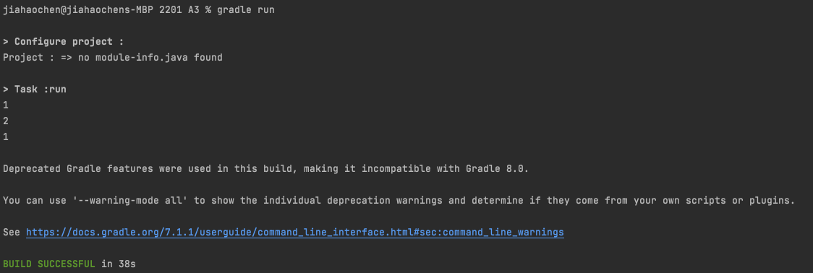

   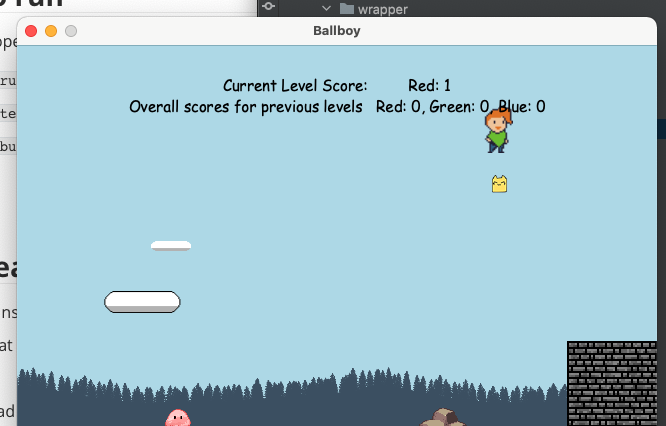

2. `gradle test` will run the tests.

   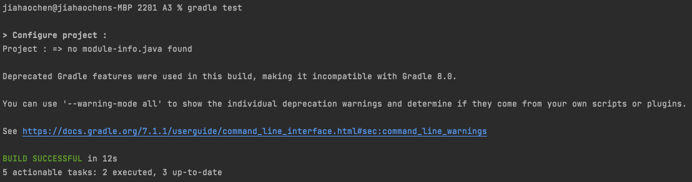

3. `gradle build jacocoTestReport` will generate a coverage report.

   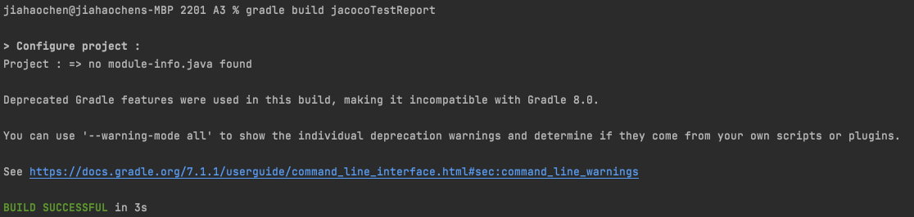

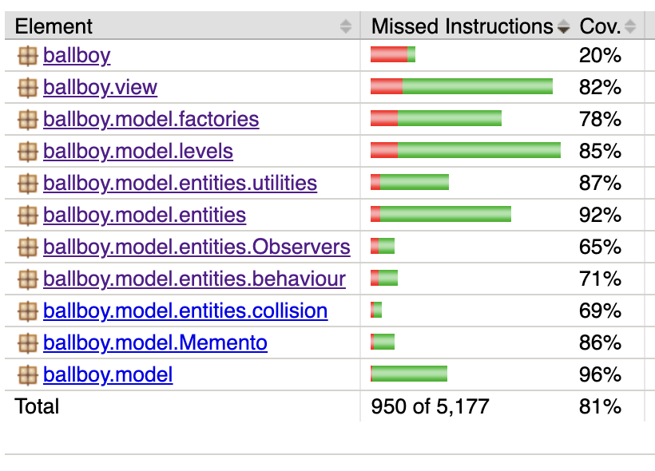

## New Features

1. Level transition

   + Configuration. I set different backgrounds for these three level

     ```json
     "levels": [
         { "the frist level configuration"},
         {	"the second level configuration"},
         {	"the third level configuration"}
     ]
     ```

   + The first level

     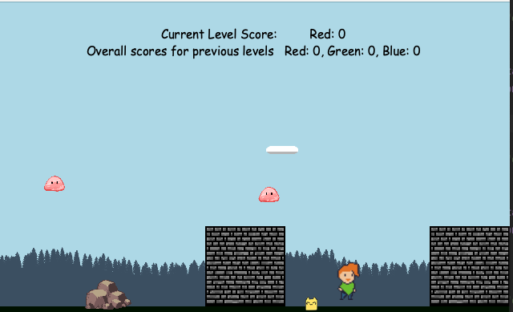

   + The second 

     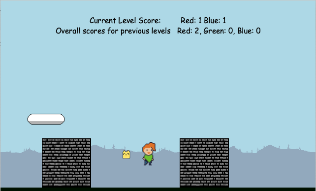

   + The third

     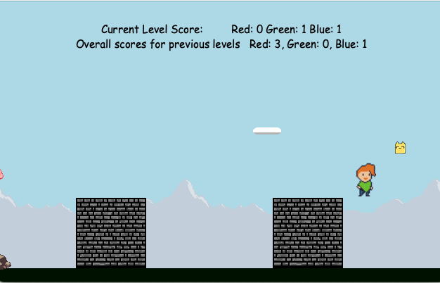

   + If reach the tree, it will go to next level, if ballboy end the last level, it will show "Winner" and exit in 3 seconds

     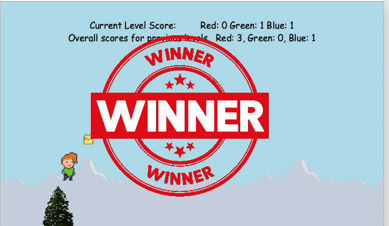

2. Squarecat

   + Configuration

      // The start position is not important, it can be random value

     ```json
       "levels": [
         {
           "genericEntities": [
             {}, 
             {},
             {}
           ],
           "squareCat":     {
             "type": "squareCat",
             "startX": 120.0,
             "startY": 300.0,
             "image": "squareCat.png"
           }
         }
       ]
     ```

   Ballboy is oribited by square cat.

   + Squarecat will pass through objects
   + Enemies touched by Squarecat will be removed from the level.

3. Score

   + Configuration

     Each level displays one to three colour scores (RGB), decided by confguration. (When you add one color score, you'd better add some correspoding colored enemies)

     ```json
     "levels": [
         {
         	"scoreColors": ["red"], ......
         },
         
         {
         	"scoreColors": ["red", "blue"], ......
         }
     ]
     ```

     As you can see in the level pictures above.

     If one colored emeny is killed by square cat, the corresponding score of that color will increase by 1.

4. Save/Load

   + **<u>Press 's' to save game states, Press 'q' to reload state.</u>**

   + There is one single state can be saved, if you save again, it will overwrite the existing state.

   + The state can be reversed multiple times.

     

## **Design patterns**

+ Observers

  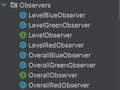

+ Memento

  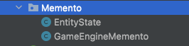

  ​																		including `LevelImpl` and `GameEngineImpl`

+ *Prototype Pattern* 

  In class `KinematicStateImpl`

  